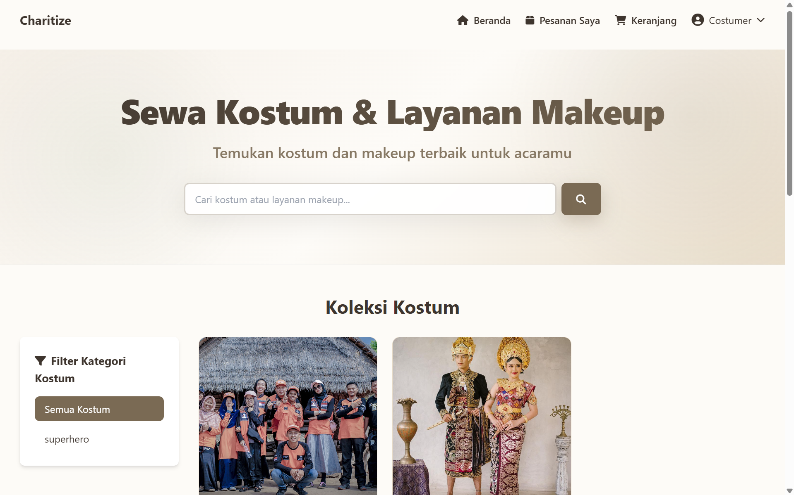
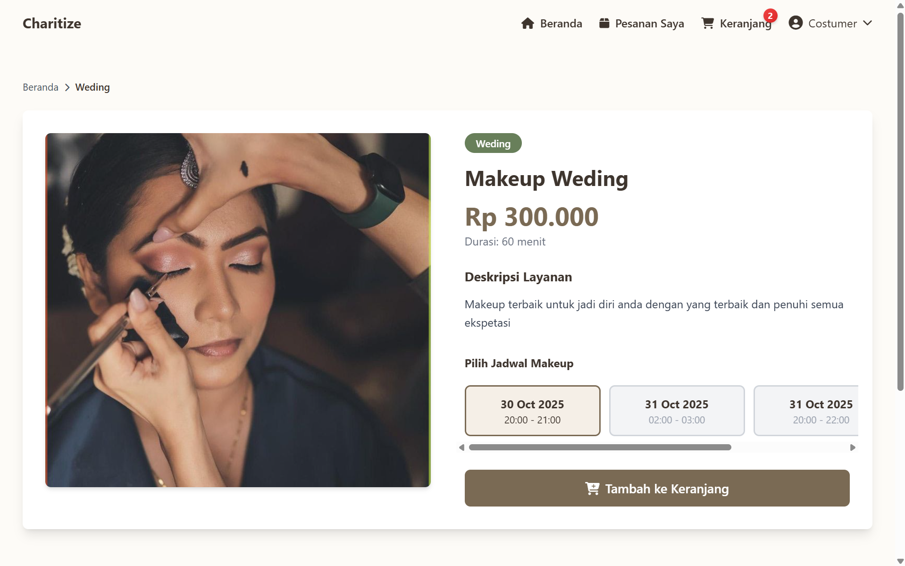
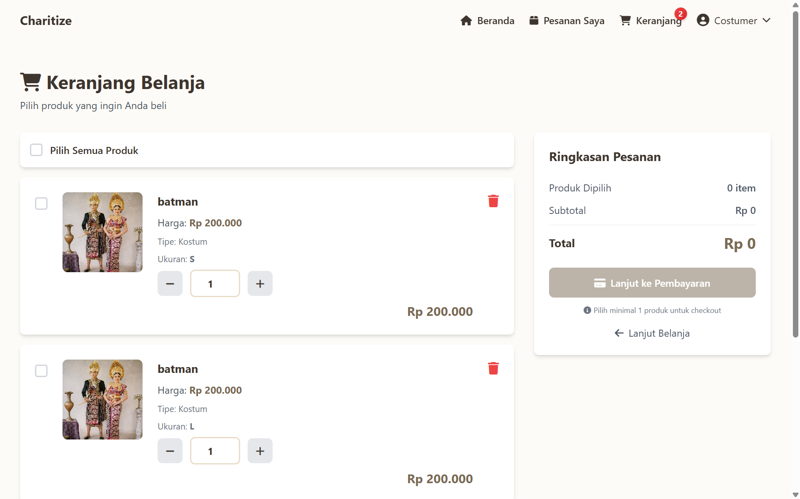
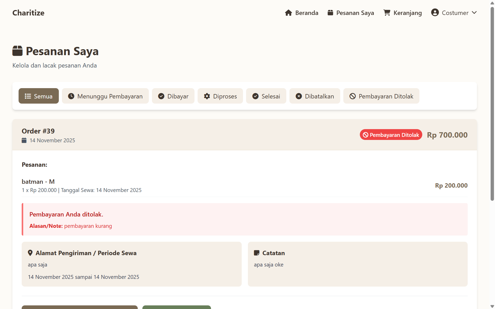

# Charitize – Costume & Makeup Service Management System

Charitize is a web-based management system designed to streamline costume rental and makeup service operations.  
The platform enables efficient management of inventory, customer transactions, service bookings, reporting, and user administration through a structured and user-friendly interface.

---

## 🔎 Overview

Charitize is built using **PHP Native** and **MySQL**, with a clean separation between customer-facing pages and an internal admin dashboard.  
The system supports key operational workflows including product management, rental transactions, order processing, and reporting (PDF/Excel).

This project is developed to demonstrate core full-stack development capabilities, including backend processing, database design, and administrative interface development.

---

## ⭐ Key Features

### Customer Module
- Customer Registration & Authentication  
- Browse Costume Catalog  
- View Makeup Service Listings  
- Add Items to Cart  
- Checkout & Transaction Processing  
- View Order History  

### Admin Module  
- Admin Authentication  
- Costume Management (CRUD)  
- Makeup Service Management  
- User/Customer Management  
- Order Management & Transaction Validation  
- Sales & Rental Reports (PDF/Excel Export)  
- Admin Dashboard with Analytics

---

## 🧩 Technology Stack

| Component        | Technology |
|------------------|------------|
| Backend          | PHP Native |
| Frontend         | HTML, CSS, JavaScript, Bootstrap 5 |
| Database         | MySQL |
| Reporting        | FPDF (PDF), PHPSpreadsheet (Excel) |
| UI Scripts       | jQuery |

---

## 📁 Project Structure
- charitize/
- admin/ # Admin dashboard & management modules
- assets/ # CSS, JS, images, icons
- config/ # Database configuration
- includes/ # Reusable components (sidebar, navbar, helpers)
- customer/ # Customer-facing UI
- database/ # SQL backup (db_penyewaan.sql)
- index.php # Home page
- login.php # Login page
- register.php # Registration page

📊 Reporting Capabilities
+ PDF Export (Orders, Costumes, Services)
+ Excel Export
+ Date-range filtering
+ Admin analytics dashboard

📸 Screenshots

📜 License
This project is licensed for educational and development purposes.

👨‍💻 Developer
Redha Artha Septaviano
Fullstack Developer
